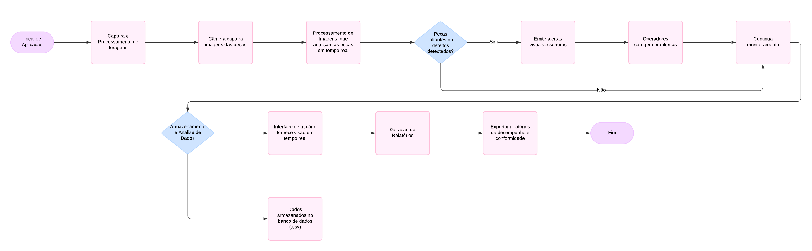

# Monitoring-Sistem
Este é um repositório criado para o versionamento de código do projeto da disciplina de Informática Industrial pela Universidade Federal de Campina Grande.

O projeto em questão visa desenvolver uma solução baseada em visão computacional capaz de identificar falhas em peças em uma linha de produção, para isto, teremos a adoção do seguinte fluxograma:

> **Imagem 1**: Fluxograma da estrutura de funcionalidade do projeto.

